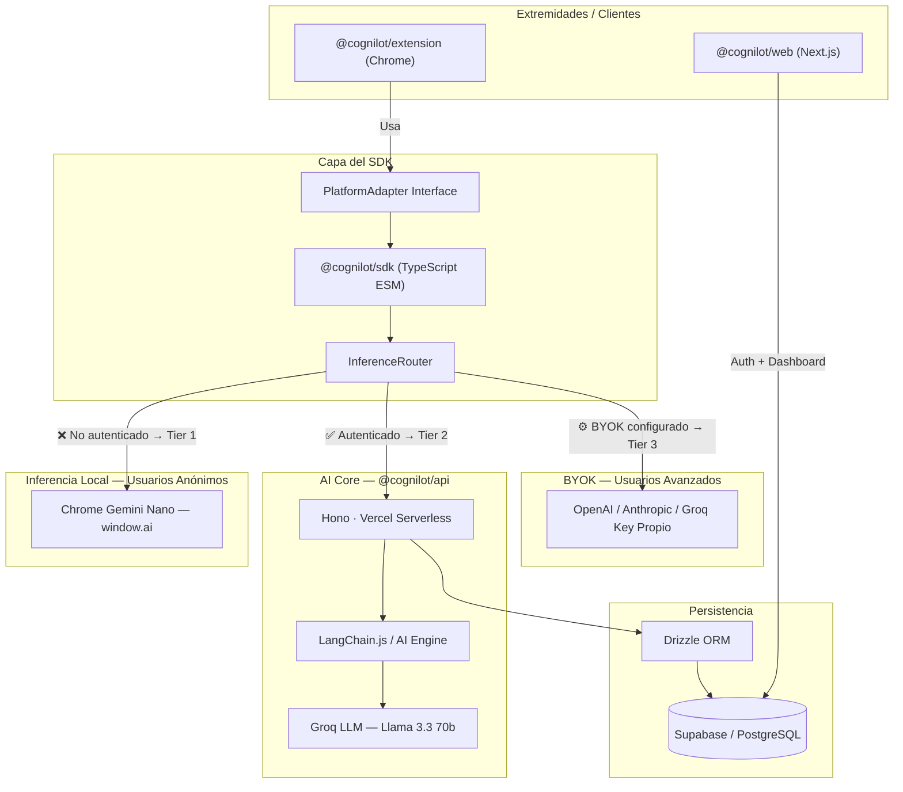
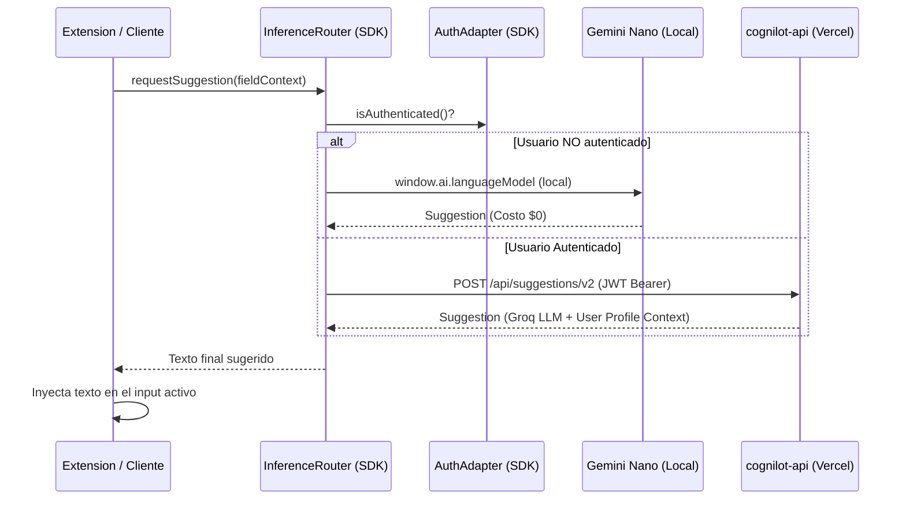
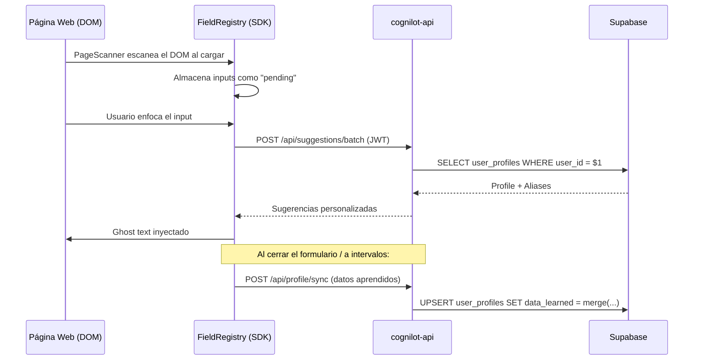

# 🏗️ Arquitectura Técnica

Este documento describe la arquitectura técnica de **Cognilot**, diseñada bajo el patrón de un Cerebro Centralizado y Múltiples Extremidades (Clientes Especializados).

El sistema separa estrictamente la capa de inferencia y almacenamiento del contexto (Backend/API) de la interacción y renderizado con la interfaz de usuario (Clientes).

> **Stack Actual (v2.0):**
>
> - **Backend:** TypeScript (Node.js) + Hono · Vercel Serverless Functions
> - **Frontend:** Next.js 15 App Router · Vercel
> - **SDK:** TypeScript ESM · pnpm Workspace
> - **Extension:** TypeScript + Vite · Chrome Web Store
> - **Database:** Supabase (PostgreSQL) + Drizzle ORM
> - **Monorepo:** pnpm Workspaces

---

## 🗺️ Diagrama de Componentes del Sistema



> **Decisión Clave:** Se implementa una **Estrategia de Inferencia por Autenticación** en lugar del modelo de cascada simple.
>
> - **Usuarios no autenticados:** `window.ai` (Gemini Nano) — costo $0, ejecución local, sin servidor.
> - **Usuarios autenticados:** Backend en la nube con Groq (mayor calidad, contexto del perfil del usuario).
> - **Usuarios avanzados (BYOK):** Clave propia que omite el backend completamente.

---

## 🔄 Flujos de Datos

### 1. Flujo de Inferencia por Autenticación



### 2. Flujo de Sincronización de Perfil (Extension → Backend)



---

## 🛠️ Entornos y Despliegue

| Entorno      | Paquete               | Hosting                       | Notas                                              |
| :----------- | :-------------------- | :---------------------------- | :------------------------------------------------- |
| **MVP**      | `@cognilot/api`       | Vercel (Serverless Functions) | `cognilot-api/vercel.json` define las rutas        |
| **MVP**      | `@cognilot/web`       | Vercel (Next.js)              | App Router, SSR para marketing, CSR para dashboard |
| **MVP**      | `@cognilot/extension` | Chrome Web Store              | Build con Vite + CRXJS                             |
| **Post-MVP** | Mobile Keyboard       | App Store / Play Store        | Usa `@cognilot/sdk` vía React Native               |

### Monorepo Structure

```
cognilot/                    ← Monorepo root (pnpm workspaces)
├── cognilot-api/            ← @cognilot/api — Hono + Vercel Serverless
├── cognilot-web/            ← @cognilot/web — Next.js 15 + Vite Hybrid
│   └── src/
│       ├── app/             ← Next.js App Router (marketing & dashboard routes)
│       └── views/           ← Vite Views (custom React CSR client pages)
├── cognilot-sdk/            ← @cognilot/sdk — Core logic, TypeScript ESM
├── cognilot-extension/      ← @cognilot/extension — Chrome Extension
├── docs/                    ← Documentation
├── .github/workflows/       ← CI/CD
└── pnpm-workspace.yaml
```

---

## 🔗 Referencias

- [🤝 Contratos de Interfaz](CONTRACTS.md)
- [🗄️ Modelo de Base de Datos](DATABASE.md)
- [🧠 Lógica Core e Inferencia](LOGIC.md)
- [🗺️ Roadmap de Producto](ROADMAP.md)
- [🎯 Alcance MVP](SCOPE.md)
