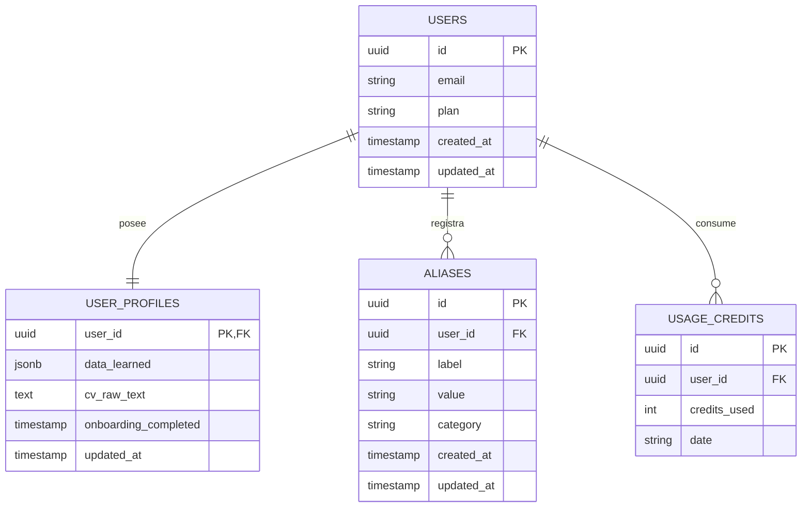

# 🗄️ Modelo de Base de Datos

Este documento define el esquema físico y relacional de la base de datos de **Cognilot** sobre PostgreSQL (alojada en Supabase). Las migraciones son gestionadas con **Drizzle ORM** desde el paquete `@cognilot/api`. Las tablas están divididas bajo un control estricto de alcance (MVP vs Alcance Futuro).

> **Herramienta de Migraciones:** Drizzle Kit (`pnpm --filter @cognilot/api drizzle-kit generate`)
> **Ubicación del Schema:** `cognilot-api/src/db/schema.ts`

---

## 🗺️ Diagrama de Entidad-Relación (ERD)

El siguiente modelo describe la relación de los datos de usuario, perfiles de aprendizaje dinámicos y alias guardados:

> **Decisión:** Se usa `JSONB` para `data_learned` en `user_profiles` para soportar un perfil dinámico que crece sin migraciones cada vez que la IA aprende un nuevo tipo de dato del usuario.

---

## 📖 Diccionario de Datos (Tablas MVP)

### 1. Tabla `users`

Almacena la identidad y plan básico del usuario registrado.

| Campo        | Tipo           | Restricciones        | Descripción                                                                    |
| :----------- | :------------- | :------------------- | :----------------------------------------------------------------------------- |
| `id`         | `uuid`         | `PRIMARY KEY`        | Identificador único del usuario. Sincronizado con `auth.users.id` de Supabase. |
| `email`      | `varchar(255)` | `UNIQUE`, `NOT NULL` | Correo electrónico del usuario.                                                |
| `plan`       | `text enum`    | `DEFAULT 'free'`     | Tipo de plan: `'free'` o `'pro'`.                                              |
| `created_at` | `timestamp`    | `DEFAULT now()`      | Fecha de creación de la cuenta.                                                |
| `updated_at` | `timestamp`    | `DEFAULT now()`      | Última actualización del registro.                                             |

**TypeScript Type (Drizzle):** `User` — exportado desde `@cognilot/api/src/db/schema.ts`

### 2. Tabla `user_profiles`

Almacena el conocimiento e información estructurada del usuario aprendida pasiva o activamente.

| Campo                  | Tipo        | Restricciones                          | Descripción                                                                                 |
| :--------------------- | :---------- | :------------------------------------- | :------------------------------------------------------------------------------------------ |
| `user_id`              | `uuid`      | `PRIMARY KEY`, `FK → users.id CASCADE` | Identificador del usuario dueño del perfil.                                                 |
| `data_learned`         | `jsonb`     | `DEFAULT '{}'`, `NOT NULL`             | Datos de perfil estructurados por la IA (Ej: `{"full_name": "Jack", "skills": ["React"]}`). |
| `cv_raw_text`          | `text`      | `NULLABLE`                             | Texto crudo del CV del usuario, para reparsear si es necesario.                             |
| `onboarding_completed` | `timestamp` | `NULLABLE`                             | Fecha en que el usuario completó el onboarding. `NULL` si incompleto.                       |
| `updated_at`           | `timestamp` | `DEFAULT now()`                        | Última actualización del perfil.                                                            |

### 3. Tabla `aliases`

Almacena valores manuales rápidos mapeados por el usuario para atajos de llenado.

| Campo        | Tipo           | Restricciones                              | Descripción                                          |
| :----------- | :------------- | :----------------------------------------- | :--------------------------------------------------- |
| `id`         | `uuid`         | `PRIMARY KEY`, `DEFAULT gen_random_uuid()` | Identificador del alias.                             |
| `user_id`    | `uuid`         | `FOREIGN KEY (users.id)`, `NOT NULL`       | ID del usuario dueño del alias.                      |
| `label`      | `varchar(255)` | `NOT NULL`                                 | Etiqueta del alias (Ej: "dni", "tarjeta_frecuente"). |
| `value`      | `text`         | `NOT NULL`                                 | Valor que debe autocompletarse.                      |
| `created_at` | `timestamp`    | `DEFAULT now()`                            | Fecha de registro.                                   |

---

### 4. Tabla `usage_credits` (MVP — Rate Limiting)

Rastrea el uso diario de créditos por usuario para el plan Free.

| Campo          | Tipo      | Restricciones                              | Descripción                                       |
| :------------- | :-------- | :----------------------------------------- | :------------------------------------------------ |
| `id`           | `uuid`    | `PRIMARY KEY`, `DEFAULT gen_random_uuid()` | Identificador del registro.                       |
| `user_id`      | `uuid`    | `FK → users.id CASCADE`, `NOT NULL`        | ID del usuario.                                   |
| `credits_used` | `integer` | `DEFAULT 0`, `NOT NULL`                    | Créditos consumidos en la fecha.                  |
| `date`         | `text`    | `NOT NULL`                                 | Fecha ISO (`"2026-06-25"`). Unique con `user_id`. |

> **Límite:** Plan Free = 50 créditos/día. Plan Pro = sin límite (no se inserta registro).

---

## 🗺️ Tablas de Alcance Futuro (Post-MVP)

### 5. Tabla `commands`

Almacenará las plantillas de prompts de las habilidades personalizadas agregadas por el usuario desde el panel web.

| Campo             | Tipo           | Restricciones     | Descripción                                          |
| :---------------- | :------------- | :---------------- | :--------------------------------------------------- |
| `id`              | `uuid`         | `PRIMARY KEY`     | Identificador del comando.                           |
| `user_id`         | `uuid`         | `FK → users.id`   | Dueño del comando.                                   |
| `name`            | `varchar(100)` | `UNIQUE per user` | El nombre para invocarlo (Ej: `/resumir`).           |
| `description`     | `text`         | `NOT NULL`        | Descripción de la habilidad.                         |
| `prompt_template` | `text`         | `NOT NULL`        | Instrucción enviada al LLM con el texto del usuario. |
| `created_at`      | `timestamp`    | `DEFAULT now()`   | Fecha de creación.                                   |

---

## 🔗 Referencias

- [🏗️ Arquitectura Técnica](ARCHITECTURE.md)
- [🤝 Contratos de Interfaz](CONTRACTS.md)
- [🧠 Lógica Core e Inferencia](LOGIC.md)
- [🗺️ Roadmap de Producto](ROADMAP.md)
- [🎯 Alcance MVP](SCOPE.md)
