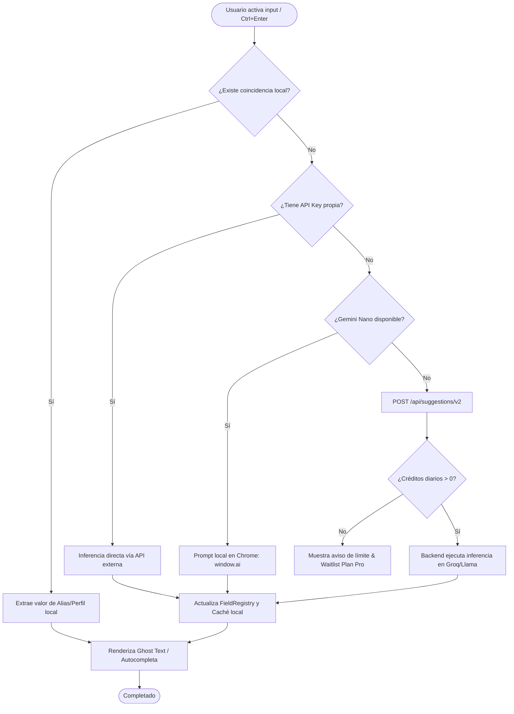

# 🧠 Lógica Core e Inferencia

Este documento detalla los algoritmos, lógica de coincidencias semánticas y el procesamiento de lenguaje natural de **Cognilot**. Explica cómo el SDK administra la caché local, cómo el motor de inferencia decide qué proveedor usar, y cómo el backend resuelve los inputs con LangChain.js.

---

## 🧠 Estrategia de Inferencia por Autenticación

A diferencia del modelo de cascada clásico, Cognilot implementa un **router de inferencia basado en el estado de autenticación del usuario**. Esto permite que cada usuario reciba la mejor experiencia posible sin costos innecesarios.

\[
\text{Resultado} = \begin{cases} \text{ResolverLocal}(\text{aliases + perfil}) & \text{si hay coincidencia directa} \\ \text{GeminiNano}(\text{input}) & \text{si no autenticado y Nano disponible} \\ \text{BackendGroq}(\text{input + perfil}) & \text{si autenticado} \\ \text{BYOK}(\text{input}) & \text{si API Key configurada (override)} \end{cases}
\]

Donde:

1. **ResolverLocal (Alias/Perfil):** Siempre se ejecuta primero. Coincidencia rápida con alias guardados y perfil del usuario en la memoria local del cliente (latencia \(<10\text{ ms}\)).
2. **Gemini Nano (Anónimo — Tier 1):** Si el usuario **no está autenticado** y el navegador tiene `window.ai.languageModel` disponible, se ejecuta inferencia local en la GPU del cliente (Costo $0).
3. **Backend Groq (Autenticado — Tier 2):** Si el usuario **está autenticado**, el SDK envía la solicitud a `@cognilot/api` con su JWT, donde el LLM procesa el input con el contexto completo del perfil del usuario (`data_learned` + aliases).
4. **BYOK (Override Total — Tier 3):** Si el usuario configuró su propia API Key (OpenAI/Anthropic/Groq), este provider sobreescribe todos los demás independientemente de la autenticación.

> **Decisión:** Esta estrategia garantiza que los usuarios anónimos puedan usar el producto gratuitamente (con Gemini Nano) mientras los usuarios registrados reciben respuestas de mayor calidad y personalización gracias al perfil centralizado en la base de datos.

---

## 🔄 Diagrama de Flujo de Inferencia

El siguiente flujo detalla cómo el SDK decide dónde procesar las solicitudes (Ctrl+Enter o autocompletado) en tiempo de ejecución:



---

## 📥 Estructura de Entradas y Salidas de la IA

### 1. Inferencia de Entrada del Asistente (`suggestions.py`)

El backend utiliza plantillas de LangChain estructuradas para refinar texto. El prompt combina:

- **System Prompt:**
  ```text
  Eres un asistente de IA invisible incrustado en el campo de texto del usuario.
  Tu tarea es responder o refinar la entrada del usuario de manera directa, concisa y sin diálogos de introducción.
  Si el usuario escribe una pregunta, responde directamente.
  Si el usuario escribe un texto a medio terminar, complétalo manteniendo el tono.
  ```
- **Contexto de Aplicación:** Informa a la IA si el usuario está en `gmail.com` (correo profesional) o `whatsapp.com` (chat casual).
- **Prompt del Usuario (Query):** El texto recuperado del input en edición.

### 2. Formato de Salida de la IA

La IA debe retornar estrictamente texto plano en formato JSON limpio, sin bloques de código adicionales:

```json
{
  "refined_text": "Texto final generado por la IA para inyectar en el campo"
}
```

---

## 🔗 Referencias

- [🏗️ Arquitectura Técnica](ARCHITECTURE.md)
- [🤝 Contratos de Interfaz](CONTRACTS.md)
- [🗄️ Modelo de Base de Datos](DATABASE.md)
- [🗺️ Roadmap de Producto](ROADMAP.md)
- [🎯 Alcance MVP](SCOPE.md)
