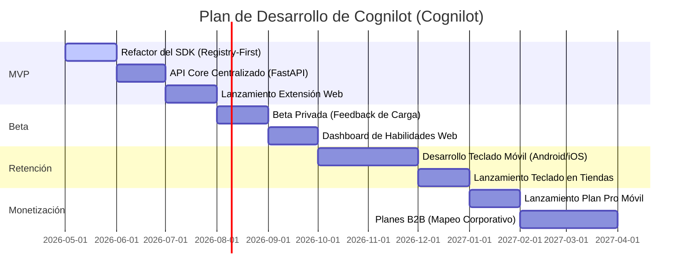

# 🗺️ Roadmap de Producto

Este documento define la planificación y las fases de desarrollo del proyecto **Cognilot (Cognilot)**. Describe la progresión del producto desde el MVP actual hasta el escalamiento con el Teclado Móvil nativo en el futuro.

---

## 📅 Cronograma Visual de Desarrollo

El siguiente diagrama detalla los tiempos estimados y dependencias de las fases principales del proyecto:

> **Decisión:** Se define que la fase Beta se ejecutará exclusivamente con la Extensión de Navegador. Desarrollar el Teclado Móvil es costoso y complejo; por lo tanto, primero validaremos el valor del "autocompletado inline" y los comandos de IA en el navegador con un grupo de usuarios Beta cerrados antes de iniciar la inversión en el teclado nativo de Android e iOS.

---

## 🚀 Desglose de Fases

### Fase 1: MVP (Foco Web & API Core)

- **Objetivo:** Consolidar el asistente de texto e inteligencia en inputs de la web usando una extensión de navegador estable y rápida.
- **Entregables Clave:**
  - `Cognilot-sdk` utilizando arquitectura de Registro Proactivo (`FieldRegistry`).
  - `/api/suggestions/v2` en el backend unificando la lógica de inferencia.
  - Caché local robusta en `chrome.storage.session` para reducir latencias.
  - Soporte de comandos básicos de barra diagonal (`/`) en inputs web.

### Fase 2: Lanzamiento Beta (Validación del Concepto)

- **Objetivo:** Abrir el producto a una base limitada de usuarios bajo invitación para pulir la UX y recopilar feedback sobre el autocompletado inline.
- **Entregables Clave:**
  - Panel de Configuración Web (`Cognilot-web`) funcional para que los usuarios gestionen sus alias y perfiles.
  - Pruebas de latencia en backend con Groq API.
  - Soporte para múltiples proveedores de IA desde la configuración.

### Fase 3: Retención & Movilidad (El Teclado Móvil)

- **Objetivo:** Escalar la propuesta de valor omnipresente a dispositivos móviles mediante la creación de un teclado de terceros.
- **Entregables Clave:**
  - Desarrollo de la app nativa de teclado (Android en Kotlin, iOS en Swift).
  - Integración del `Cognilot-sdk` nativo consumiendo el mismo API centralizado.
  - Botón integrado de IA en el teclado para realizar el "reemplazo inline" de prompts.
  - Implementación de lectura explícita del portapapeles del dispositivo para inyectar contexto de imágenes o textos copiados.

### Fase 4: Monetización y Escalamiento (Post-MVP)

- **Objetivo:** Introducir la pasarela de pagos y habilitar integraciones corporativas.
- **Entregables Clave:**
  - Planes Pro con límites ampliados de solicitudes de IA al mes.
  - Habilidad para subir plantillas de comandos corporativas compartidas.
  - Integración con Stripe en el panel web.

---

## 🔗 Referencias

- [🏗️ Arquitectura Técnica](ARCHITECTURE.md)
- [🤝 Contratos de Interfaz](CONTRACTS.md)
- [🗄️ Modelo de Base de Datos](DATABASE.md)
- [🧠 Lógica Core e Inferencia](LOGIC.md)
- [🎯 Alcance MVP](SCOPE.md)
